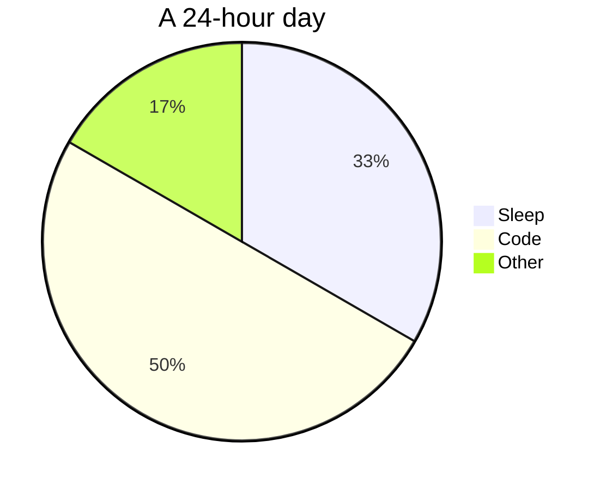

<h1 align="center">Hello 👋 I'm Tom Tamen</h1>
<h3 align="center">A passionate apprentice developer !</h3>

  

- 🌱 I am developing my skills in different areas such as Frontend and Backend. The status that corresponds to me the most for the moment is Fullstack but I plan to evolve towards the Backend

- 📫 How to contact me ? **contact@tom-tamen.fr**

-My website : www.tom-tamen.fr  

<h3 align="left">My linkedin profile :</h3>

<h2 align="left">Languages and tools</h2>
 
<h3 align="left">Frontend</h3>

	
	
	
	
	
	

 
<h3 align="left">Backend</h3>

	
	
	
	
	

 
<h3 align="left">CMS</h3>

	

 
<h3 align="left">Tools</h3>

	
	
	
	
	
	

 

<h3 align="left">My statistics :</h3>

