```mermaid
pie title Une journée de 24h
    "Dormir" : 8
    "Coder" : 12
    "Autre" : 4
```

<h1 align="center">Bonjour 👋, je suis Tom Tamen</h1>
<h3 align="center">Un apprenti développeur passionné !</h3>

  

- 🌱 Je développe mes compétences dans différents domaines tel que **javascript, php, ux design, ui design**

- 📫 Comment me contacter ? **contact@tom-tamen.fr**

<h3 align="left">Mon profil linkedin:</h3>

<h3 align="left">Languages et outils</h3>

             

<h3 align="left">Mes statistiques :</h3>

